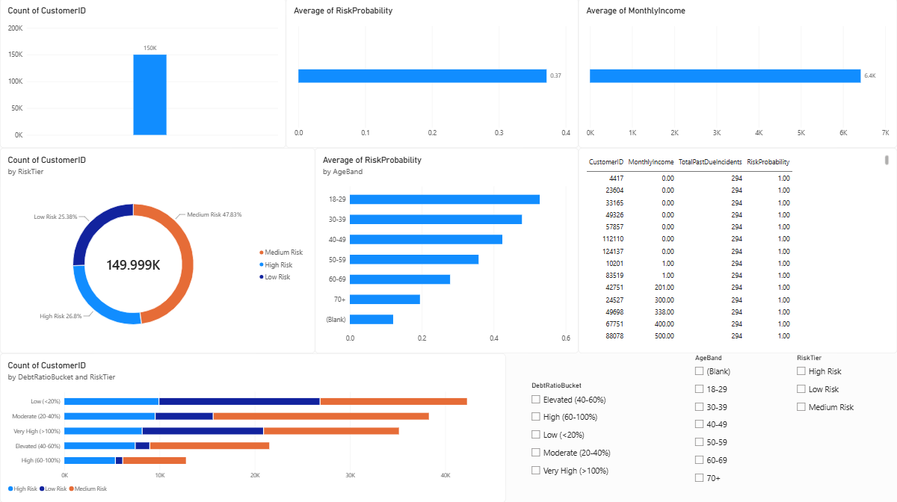

<div align="center">

# 🏦 Bank Transactions & Customer Financial Risk Analytics Dashboard

**An end-to-end pipeline that scores ~150,000 bank customers for credit/delinquency risk**
**and surfaces the results in an interactive Power BI dashboard.**


</div>

---

## 📌 Overview

Banks need to know, *before* a customer defaults, who is likely to become seriously
delinquent — this project builds that early-warning system. Using a public dataset of
~150,000 anonymized bank customers, I engineered risk features, trained a logistic
regression model to score each customer's probability of serious delinquency, loaded the
results into an Azure SQL Database, and built a Power BI dashboard so the risk
segmentation is explorable by anyone, not just someone reading raw numbers in a notebook.

## 🖼️ Dashboard Preview



## 🔁 Pipeline

```
Kaggle Dataset (CSV)
        │
        ▼
Python — pandas & scikit-learn
  • Clean missing values & outliers
  • Engineer risk features (past-due totals, debt ratio buckets, age bands)
  • Train logistic regression risk model  (AUC ≈ 0.83)
  • Score every customer → Low / Medium / High risk tier
        │
        ▼
Azure SQL Database
  • Cleaned, scored data loaded via SQLAlchemy
        │
        ▼
Power BI Dashboard
  • KPI cards, risk-tier breakdown, age/debt-ratio segmentation, top-risk customer table
```

## 🛠️ Tech Stack

| Layer | Tools |
|---|---|
| Data cleaning & modeling | Python — `pandas`, `numpy`, `scikit-learn` |
| Cloud data storage | Azure SQL Database |
| Data loading | `SQLAlchemy`, `pyodbc` |
| Dashboard / BI | Power BI Desktop |
| Version control | Git & GitHub |

## 📊 Key Results

- Logistic regression model achieved an **AUC ≈ 0.83** on held-out test data
- Segmented **~150,000 customers** into **Low / Medium / High** risk tiers
- Built an interactive dashboard with **KPI cards, risk-tier breakdown, age-band risk
  trends, debt-ratio segmentation, and a filterable top-risk customer table**
- *[Add your one standout insight here — e.g. "customers in the 'Very High' debt-ratio
  bucket account for X% of the High Risk tier"]*

## 📂 Files

| File | Description |
|---|---|
| `*.ipynb` | Full notebook — data cleaning, feature engineering, model training, risk scoring |
| `*.pbix` | Power BI dashboard file |
| `customer_risk_scored.csv` | Cleaned, scored output dataset |
| `dashboard.png` | Dashboard screenshot (shown above) |
| `.gitignore` | Excludes credentials and raw data from version control |

> **Note:** the raw dataset is not included in this repo — download it directly from
> Kaggle using the link below.

## 📈 Dataset

**"Give Me Some Credit"** — Kaggle
🔗 https://www.kaggle.com/datasets/lamine16/give-me-some-credit

## 🚀 Setup

```bash
pip install pandas numpy scikit-learn sqlalchemy pyodbc python-dotenv jupyter
```

1. Download the dataset from the Kaggle link above.
2. Open and run the notebook top to bottom.
3. (Optional) Fill in your own Azure SQL credentials to load results into a live database.
4. Open the `.pbix` file in Power BI Desktop to explore or rebuild the dashboard.

## 🔮 Possible Next Steps

- Add a second model (e.g. gradient boosting) and compare performance
- Automate the pipeline with a scheduled Azure Function
- Publish the dashboard to Power BI Service for live sharing

---

<div align="center">

**Built by Shashank Reddy Challa**
[LinkedIn](#) · [GitHub](#)

</div>
